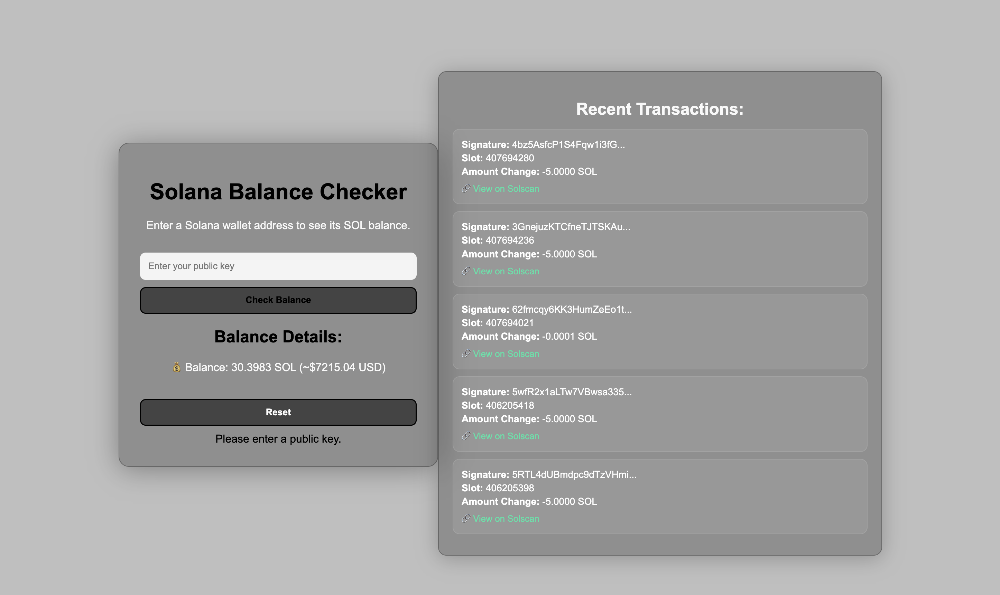

# 🌐 Solana Balance Checker


A simple web app to check the balance of any **Solana wallet** and view recent transactions.  
Built with **HTML, CSS, and JavaScript** using the [`@solana/web3.js`](https://solana-labs.github.io/solana-web3.js/) library.

---

## 📸 Screenshot



---

## ✨ Features

- 🔑 Enter any Solana wallet **public key** to check its balance
- 💰 Displays the **SOL balance** in real-time
- 📜 Fetches and lists **recent transactions**
- 🎨 Clean glassmorphism UI with responsive design
- 🗑️ Supports reset and error handling

---

## 📂 Project Structure

```bash
balance-checker/
├── assets/
│   ├── css/
│   │   └── style.css
│   ├── js/
│   │   └── index.js
│   └── images/
│       └── solona.png
├── index.html
└── README.md
```
